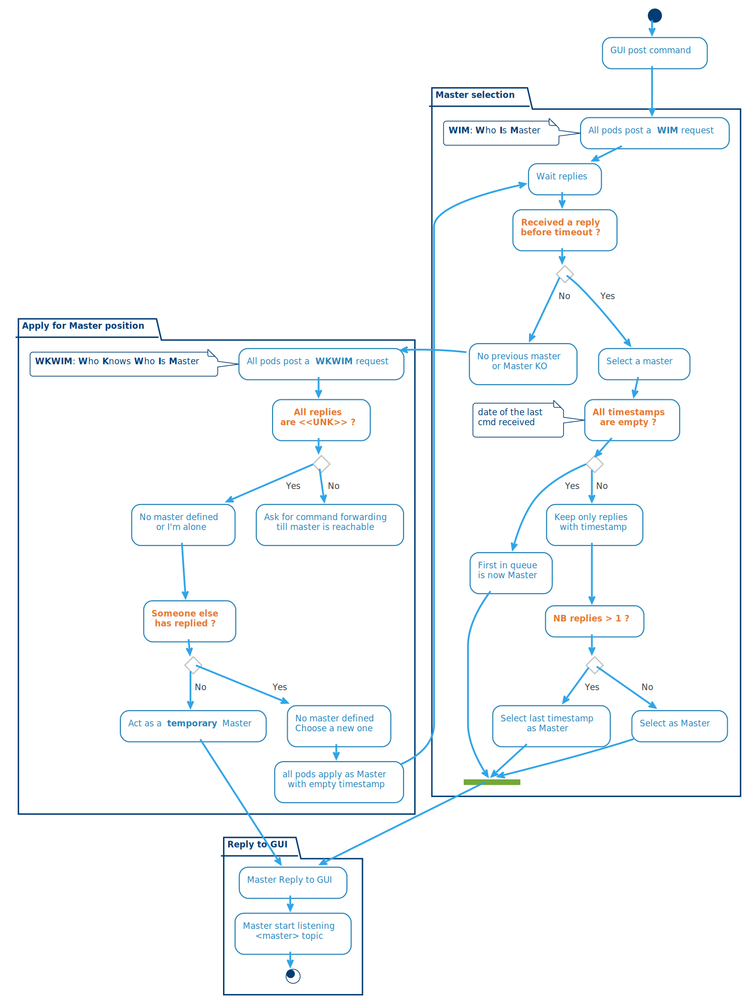
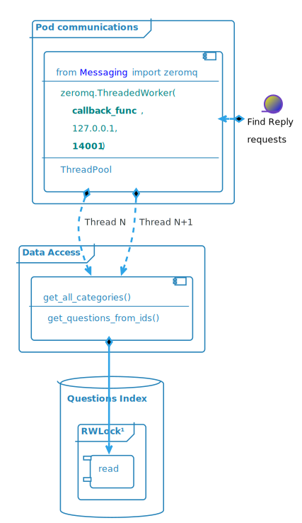

# Admin Module

## Architecture Overview

##  


## Attributes

* Centralise project's data
* Access point for the admin GUI
* Manage an index of Questions and Replies
  * This index can be saved on disk (pickle protocol) in a first stage
  * In a later development, the use of an Elasticsearch database instead of a local file could be considered

>NB: Many parts of previous version of maestro's code can be reused.

## Docker Configuration

### ENVIRONMENT VARIABLES
* <u>Mandatory</u>
  * **RMQ_IP**: RabbitMQ broker FQN or IP
  * **GIT_SERVER**: GOGS FQN or IP
  * **GIT_BRANCH**: Kingdom branch
  * **DOMAIN**: Client's domain name on GIT
  * **PROJECT**: Client's project name
  * **TARGET**: Pod's target (or branch) - ex: prod, test, ...
  
* <u>Optional</u>
  * RMQ_USER: _tbott_
  * RMQ_PASSWD: _M0m3n773ch_
  * RMQ_TOPIC: *$GIT_DOMAIN.$GIT_PROJECT.$TARGET*
  * RMQ_EXCHANGE: *amq.topic*
  * ENCODER_QUEUE: _tbott-encoder_
  * RMQ_PORT: _5672_
  * LOG_LEVEL: _INFO_


### VOLUMES
* logs: mounted in /var/log/supervisor
* data_dir: mounted in /opt/admin

## Admin Master election

### Messaging architecture

* 2 topic queues:
  * **Q** for questions (_$DOMAIN.$PROJECT.$TARGET_.**Q**.#)
  * **A** for answers  (_$DOMAIN.$PROJECT.$TARGET_.**A**.#)
  * All **Admin** modules see all _questions_ and all _answers_

###  


### State diagram 

###  




## Admin GUI commands

* Commands are atomics → no need for multithreading
* Commands are adressed to multiple Pods
* Only one pod, the master, reply to all commands


### Messaging architecture

####  


### Command processing

###  


##### Messages from Admin GUI:

  * Normaly, only an **update** request is necessary:
    ```json
    {"request" : "update"}
    ```
  * If needed you can pass optional parameters to change the kingdom's branch or the project's branch:
    ```json
    {"request": "update",
     "kingdom": "training",
     "branch": "v6"
     }
    ```
    * A kingdom branch change may be needed when changing the access to other Domains/Projects
    * A project branch change may be trigerred by a rollback or a testing procedure

### FAISS request example:
```json
{"requests" : ["create"],
 "create" : [
               {"vector" : numpy.array , "id" : 1},
		       {"vector" : numpy.array , "id" : 2}
             ]
} 
```


### Questions index example:
```python
{
  "git": {"path": DOMAIN/PROJECT
          "branch": test,
          "commit": git_commit_number
          }
  "references": {
    ref_1: {"ids": [id1, id2],
            "categories": {"N1": "n1_cat1", "N2": "n2_cat1"},
            "reply": "a reply..."
            }
    ref_2: {"ids": [id3],
            "categories": {"N1": "n1_cat2", "N2": "n2_cat2"},
            "reply": "another reply..."
            }
  }
  "all_categories": [{"N1": "n1_cat1", "N2": "n2_cat1"},
                      {"N1": "n1_cat2", "N2": "n2_cat2"}]
  "ids":{
    id1: {
        "ref": ref_1,
        "question": "a quetion",
        "augmented": false,
        "vector": np.array},
    id2: {
        "ref": ref_1,
        "question": "n1_cat, a quetion",
        "augmented": true,
        "vector": np.array},
    id3: {
        "ref": ref_1,
        "question": "n1_cat, n2_cat, a quetion",
        "augmented": true,
        "vector": np.array},
    id4: {
        "ref": ref_2,
        "question": "a 2nd quetion",
        "vector": np.array}
    }
}
```
## Questions Index queries

* Internal requests from **Find Reply** module
* Multithreaded
* Access the index through a **Read/Write Lock** with priority on **Write**
  * RWLock lib: https://github.com/elarivie/pyReaderWriterLock

* Exemple of context request:
   * request:
      ```json
      { "request": "get_contexts"}
      ```
   * reply:
      ```json
      { 
      "request": "get_contexts",
      "result":  [{"cat1": [{"cat1": "DDAY"}]},  
                  {"cat1_cat2": [{"cat1": "D-DAY", "cat2": "Bilan"},  
                                 {"cat1": "D-DAY", "cat2": "Cimetières"}
                                ]}]
      }
      ```

* Exemple of info request:
   * request:
      ```json
      { "request": "get_candidates",
        "ids": [1, 2, 3]}
      ```
   * reply:
      ```json
      { 
      "request": "get_candidates",
      "result":  [{"id": 1, "ref": "DDAY/dday/20", 
                   "question": "Quelles sont les plages du débarquement ?", 
                   "augmented": false, 
                   "reply": "Les 5 plages du débarquement sont ...", 
                   "cat1": "D-DAY", "cat2": "Lieux de Batailles"}, 
                  {"id": 2, "ref": "DDAY/dday/20", 
                   "question": "D-DAY, Quelles sont les plages du débarquement ?", 
                   "augmented": true, 
                   "reply": "Les 5 plages du débarquement sont ...", 
                   "cat1": "D-DAY", "cat2": "Lieux de Batailles"},
                  {"id": 3, "ref": "DDAY/dday/20", 
                   "question": "D-DAY, Lieux de Batailles, Quelles sont les plages du débarquement ?", 
                   "augmented": true, 
                   "reply": "Les 5 plages du débarquement sont ...", "cat1": "D-DAY", "cat2": "Lieux de Batailles"}
                  ]}
      ```
###  



