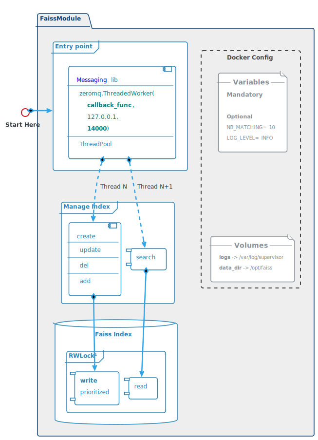

# FAISS Module

## Attributes
* Based on [Facebook AI Similarity Search](https://ai.facebook.com/tools/faiss/)
* Heart of a **fast** search system</li>
* Able to index litteraly **billions** of inputs</li>
* Only handle **matrices**, of any shapes</li>
* As **simple** as possible, to reduce risks.</li>
* As **generic** as possible, to be reusable for any kind of inputs</li>


## Architecture Overview
##  
<TABLE>
  <TR>
    <TD style="vertical-align: top">
      <u>Entry Point:</u>  
      <ul>
        <li>Uses **Messaging** lib</li>
        <li>**Internal** communication only (Admin & FindReply)</li>
        <li>Based on **ØMQ** for fast exchanges</li>
        <li>**Multithreaded** to serve mutliple requests</li>
        <li>Receives requests with **Numpy** arrays</li>
      </ul>
      </br>
      <u>Manage Index:</u>  
      <ul>
        <li>Handle 2 scenarios:
          <ul>
            <li>Indexing requests</li>
            <li>Search requests</li>
          </ul>
        </li>
      </ul>
      </br>
      <u>Faiss Index:</u>  
      <ul>
        <li>Protected by a [Read/Write Lock](https://github.com/elarivie/pyReaderWriterLock)</li>
        <li>Priority given to write access</li>
        <li>Index is saved in **data_dir** volume</li>
      </ul>
    </TD>
    <TD style="width:55%"></TD>
  </TR>
</TABLE>

## Docker Configuration
  
### ENVIRONMENT VARIABLES
* <u>Mandatory</u>
  * None
* <u>Optional</u>
  * NB_MATCHING: number of matching results to return  
      ► High enougth to include the right wuestion, if it exists  
      ► Low enougth to not overcharge **sentence matching** module  
      ► default = _10_  
  * LOG_LEVEL: _INFO_  

### VOLUMES
* logs: mounted in /var/log/supervisor
* data_dir: mounted in /opt/faiss


## Indexing procedure
As stated in Faiss [FAQ](https://github.com/facebookresearch/faiss/wiki/FAQ) only the *add* procedure is supported.  
Thus the *delete* and *update* procedures boils down to simply re-creating a new index.  
This imply that the list of vectors and the their associated id must be saved on disk.  
</br>
Indexing requests come from **Admin** module.  
A **create** request always comes alone.  
**delete**, **add** and **update** requests may come in any combinations.  

### Creating a new Index

_Deserialized **create** request example:_  
```
{"requests" : ["create"],
 "create" : [
               {"vector" : numpy.array , "id" : 1},
		       {"vector" : numpy.array , "id" : 2}
             ]
} 
```

###  

1. Create a **Flat** index
2. Add the list of vectors and their IDs to the index
3. Save the index on disk in **$data_dir** (cf. docker configuration)
4. Save the list of vectors and their IDs on disk in **$data_dir**
   - use pickle protocol to save python dict with numpy arrays on disk
   - check *data_factory.prepare_data* function in maestro for an example  

Code snippet
```python
import faiss
import numpy as np

with alock.gen_wlock():
  xb = np.array(get_vector_list(request)) # create matrix
  dim = xb.shape[1]                       # vector's dimension
  tmp_index = faiss.IndexFlatL2(dim)      # Flat index without ids
  ids = get_ids(request)
  index = faiss.IndexIDMap(tmp_index)     # index with ids
  index.add_with_ids(xb, ids)             # add vectors and ids
```

### Updating the Index
**delete**, **add** and **update** requests may come in any combinations.  
<u>To update an index:</u>

1. retrieve vectors and IDs from disk
2. update as specified
3. create a new index
4. save new index and new data on disk


_updating request example:_  
```python
{ "requests" : ["add", "update", "delete"],
  "add" : [{"vector" : numpy.array , "id" : 10}],
  "update": [{"vector" : numpy.array , "id" : 11}],
  "delete": [{"id": 1}, {"id": 2}]
} 
```

## Searching procedure

Indexing requests come from **FindReply** module.  
Return a matrix of shape *2* X *Nb_Questions* X *$NB_MATCHING*   
* shape **2** correspond to IDs and scores
* shape **Nb_Questions**  correspond to the number of questions to search
* shape **$NB_MATCHING** correspond to the number of matchings to return  
  (defined in docker config)

###  

_search request example:_  

```python
{ "requests" : ["search"],
  "search" : [numpy.array , numpy.array]
} 
```

###  
Code snippet
```python
#K=NB_MATCHING : Number of results returned by query (default = 10)
with alock.gen_rlock():
  S, I = index.search(q_vectors, K) # S: scores, I: indexes
  res = np.array([I, S])            # Transform S and I in a matrix
  send(res)
```