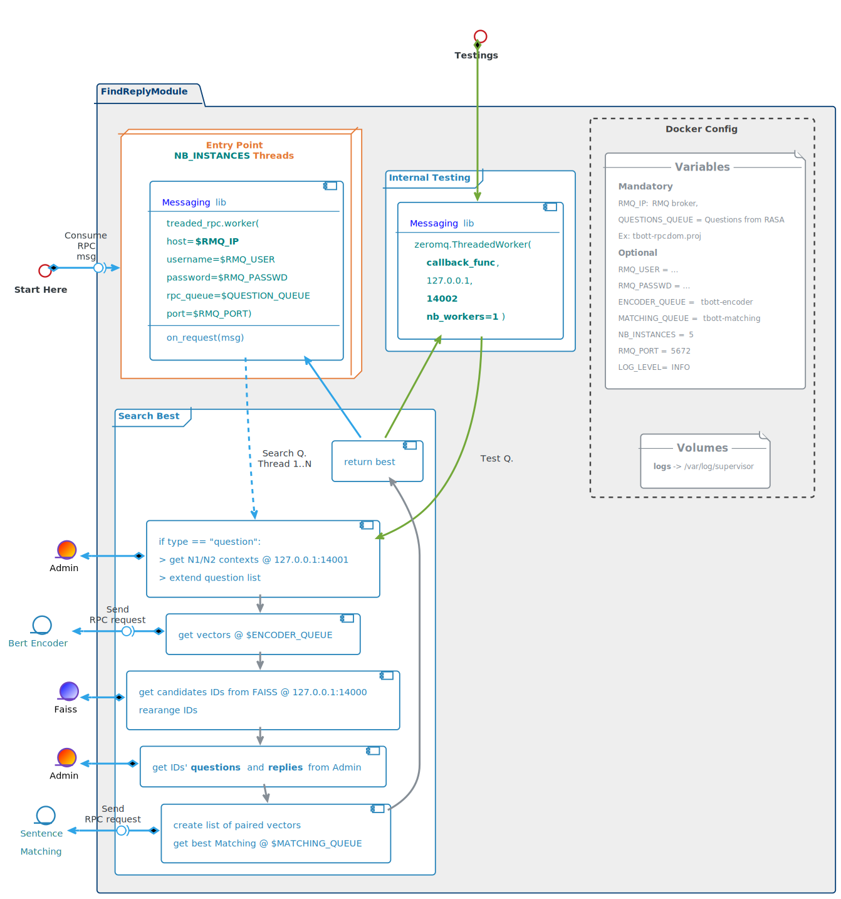
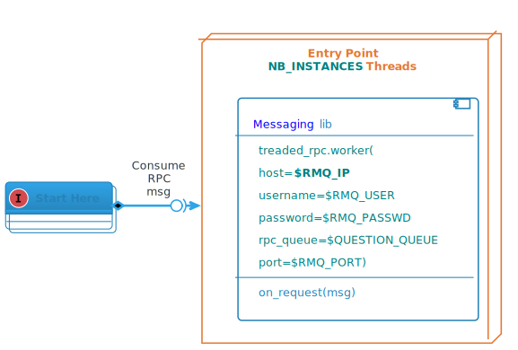

# Find Reply Module

## Architecture Overview

##  



## Attributes
* Aggregate content from different sources
* Most of its time spent in waiting a reply from those sources
* Must use mutlithreading to serve RPC requests from RASA to optimize performances

## Docker Configuration

### ENVIRONMENT VARIABLES
* <u>Mandatory</u>
  * **RMQ_IP**: RabbitMQ broker FQN or IP  
  
* <u>Optional</u>
  * **NB_INSTANCES**: number of allocated threads  
      ► limits the number of questions in parallel  
      ► defines service level capacities (dimensioning rule)  
      ► default =  *5*  
  * RMQ_USER: _tbott_
  * RMQ_PASSWD: _M0m3n773ch_
  * QUESTIONS_QUEUE: _tbott-rpc_    (Questions from RASA)
  * ENCODER_QUEUE: _tbott-encoder_  (Bert encoder queue)
  * MATCHING_QUEUE: _tbott-matching_ (Sentence matching queue)
  * RMQ_PORT: _5672_
  * LOG_LEVEL: _INFO_  


### VOLUMES
* logs: mounted in /var/log/supervisor

## Communications
_most of the code can be picked from the previous version of Maestro_  
   

### Two type of requests  
To be compatible with the existing  
  * "question" : questions coming from _RASA_
  * "analyse_sentence" : From _Analyser_  
    * can be implemented in a second or third stage ~ not mandatory ~  
    * reuse codes from the previous Maestro version  
    * needs to generate a list of questions with one and two words missings  
    * number of free threads must be set to 0, or heavily decreased, to save resources


#### code trails
Line _51_ of ai_worker.py:
```python
self.worker = Worker(ip, user, passwd, channel, self.handle_message)
```

Line _57_ of ai_worker.py:
```python
def handle_message(self, msg):
  """
    Callback to handle messages
  """
  LOGGER.debug('Received: %s', msg)
  try:
    request = json.loads(msg)
    if request['type'] == "question":
      full_answer = self.find_reply(request)
      return json.dumps(full_answer)
    elif request['type'] == "analyse_sentence":
      full_answer = self.analyse_sentence(request['content'], request['categories'], request['reference'])
      return json.dumps(full_answer)

...
```

#### Step 1: contexts
_NB: only if message is a "question" (ie comes from RASA)_
1. get all possible categories (or contexts) from Admin.
2. extend question list with all _possible_ contexts

#### Step 2: vectors
Send question list to rabbitMQ $ENCODER_QUEUE using the _Messaging_ library.

Request example:
```python
{ 
  "request": "encode",
  "content": ["original_question", "extended_question1", "..."]
}
```

Reply example:
```python
{ 
  "encoded": [numpy.array, numpy.array, numpy.array]
}
```

#### Step 3 : candidates 
Get possible candidates from **FAISS** module (127.0.0.1:14000)  

Search request example:  
```python
{ "requests" : ["search"],
  "search" : [numpy.array , numpy.array]
} 
```

FAISS reply example:  
```python
{ "result" : numpy.array }
```

####  
The **FAISS** module send back a matrix of size **2 x nb_questions x nb_results** :
* 2 : IDs and scores (in this order)
* nb_questions: number of questions sent to FAISS
* nb_results: number of results per question (_top k results_)

####  
If the question comes from RASA (ie message type = "question"), then all the questions are derivated from the original question.  
Which means that the results must be consolidated into only one list of IDs.  
This shouldbe done via **Numpy** as python's loops are quite time consuming.

Code snippet:
```python
res = search_faiss(q_vectors)
I = res[0]
S = res[1]
NQ = I.shape[0]              # Number of questions
K = I.shape[1]               # Number of results per question
I_ = np.reshape(I, NQ * K)   # reshape matrice into a list
S_ = np.reshape(S, NQ * K)   # idem
res_ids = np.argsort(S_)     # indexes of the sorted scores
#first occurence of each result
_, i = np.unique(I_[res_ids], return_index=True)
I_ = I_[i]                   # keep uniq ids
S_ = S_[i]                   # Keep uniq scores
final_idx = np.argsort(S_)   # Indexes of the sorted scores
final_idx = final_idx[:K]     # Keep only the K first results
final_ids = I_[final_idx]
final_scores = S_[final_idx]
return final_ids, final_scores
```

#### Step 4 : Questions to match

1. Get from **Admin** questions and replies associated to the list of candidates IDs.  
2. Build a list of paired questions.
   * Augmented questions must be paired only with questions from the same categories/contexts


#### Step 5 : Best match

1. Send the list of questions pairs to rabbitMQ $MATCHING_QUEUE using the _Messaging_ library.
2. Build the final reply with the best match and other candidates
  * chuncks of previous version of Maestro can be reused to speed up devs


## Testing procedure
<TABLE>
  <TR>
    <TD style="vertical-align: top">
      <ul>
        <li>**"backdoor"** to test question directly from admin consol</li>
        <li>Uses **Messaging** lib</li>
        <li>**Internal** communication only (Admin)</li>
      </ul>
    </TD>
    <TD style="width:55%"></TD>
  </TR>
</TABLE>
