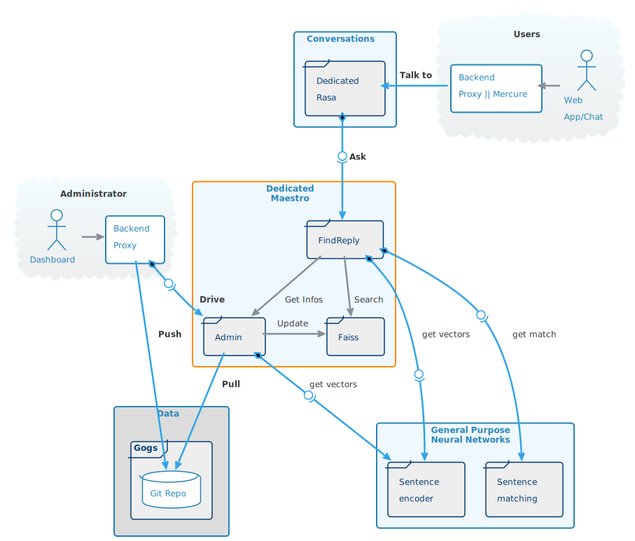
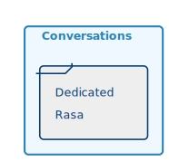
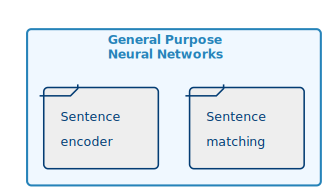

# Current limitations

* Created for one big client, not in line with our current needs
* Requires re-training for every new data added
* Training process hard to fully automized
* Categories and sub-categories are hard to define correctly
* Problems arise when using datasets with overlapping meanings

# Guide lines for the new architecture

* Avoid specific trainings whenever it's possible
* Do not require huge amount of data to start working
* By default, no data leaks between projects
* Use categories as **contextual helps** instead of storage boxes  
  Ex: The question _How many dead during the landing ?_  
  in the absolute, is **not equal to**  
  _How many dead during the landing of the bay of pigs ?_  
  **nor**  
  _How many dead during the landing of the D-Day ?_  

# Architecture Overview
## Context

###  

### Rasa(s)

Because each project has its own instance of Maestro, we must also have multiple instances of Rasa, one per Maestro  

### IAs

As explained in [Sentence-BERT: Sentence Embeddings using Siamese BERT-Networks](https://arxiv.org/pdf/1908.10084.pdf) paper, while pretrained BERT model perform poorly for sentence embeddings, BERT models fine-tuned on sentence matching are slow and resource hungry.  

So to build an efficient search engine we must use two different models,
* one for sentence encoding that will be fed to an efficient search index such as FAISS to quickly output candidates,
* and another one for sentence matching to be able to make the difference between a _best match_ and a _true match_ 

#### Sentence Encoder
* Encode sentence as a contextual vector
* ex: [Universal Sentence Encoder Multilingual](https://tfhub.dev/google/universal-sentence-encoder-multilingual/3) from Google
* Used in Faiss Index to find best **candidates**
* Trained only **once**
* Follows *SOTA* improvements

#### Sentence Matching
* Tells if two sentences are the same or not
* Provides  **relevance score**
* Do not use _sentence encoder_'s vectors
* Trained only **once**
* Follows *SOTA* improvements

## Maestro

* *Maestro* is split in 3 parts for maintainability and efficiency.
* All 3 containers are grouped within the same Pod
* A Pod is dedicated to a _Target_ (ex: prod or test) attached to a _Project_ within a _Domain_  
  In this doc referred as _Domain.Project.Target_
* For redundancy and scalability, multiple Pods can share the same _Domain.Project.env_
* Communications within a Pod is done through ZeroMQ on 127.0.0.1  
  Containers within a Pod share the same network namespace, enabling the use of localhost address.  
  ZeroMQ is fast, flexible and is indifferent to the startup order of clients and servers.  
  It will more or less act as an IPC within the Pod
* Messages between containers will use JSON format containing [Numpy](https://numpy.org/) arrays.  
  Exemple of numpy serialisation with ZeroMQ: https://pyzmq.readthedocs.io/en/latest/serialization.html

#### Modules description

* [FAISS](./FAISS/README.md)
* [FindReply](./FindReply/README.md)
* [Admin](./Admin/README.md)